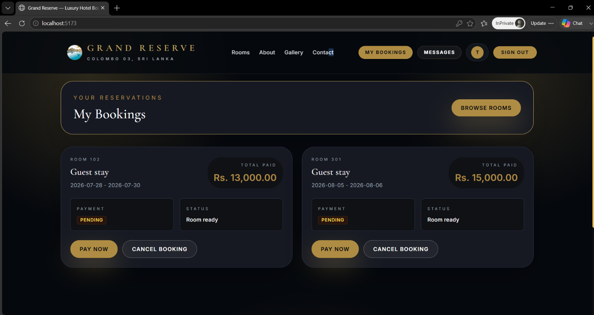

# 🏨 Grand Reserve Hotel Reservation System

Grand Reserve is a full-stack hotel reservation application built with a React frontend and a Spring Boot backend backed by MongoDB. 

**🌐 Live Demo:** https://hotel-reserve.vercel.app/


## 📖 Table of Contents

- [Overview](#overview)
- [Features](#features)
  - [Customer features](#customer-features)
  - [Admin features](#admin-features)
- [Technology stack](#technology-stack)
  - [Frontend](#frontend)
  - [Backend](#backend)
- [Backend architecture](#backend-architecture)
- [Project structure](#project-structure)
- [Running the project](#running-the-project)
  - [Prerequisites](#prerequisites)
  - [Backend](#backend-1)
  - [Frontend](#frontend-1)
- [Environment variables](#environment-variables)
- [Main API endpoints](#main-api-endpoints)
  - [Authentication](#authentication)
  - [Rooms](#rooms)
  - [Reservations](#reservations)
  - [Admin and customer management](#admin-and-customer-management)
  - [Messages and dashboard](#messages-and-dashboard)
- [Screenshots](#screenshots)
- [Future Improvements](#future-improvements)
- [License](#license)
- [Authors](#authors)

---

# Overview

Grand Reserve Hotel Reservation System is a modern hotel management platform built using **Spring Boot**, **MongoDB**, **React**, and **Tailwind CSS**.

The application provides two separate experiences:

- **Customer Portal** – Search rooms, create bookings, manage reservations, make payments, and communicate with hotel staff.
- **Admin Portal** – Manage rooms, customers, reservations, payments, guest messages, check-ins/check-outs, and administrator accounts.

The backend exposes a secure REST API protected with JWT authentication, while the frontend provides a responsive and user-friendly interface.

---

# Features

## Customer features

- register and sign in securely
- browse available rooms
- create reservations for selected dates
- view their own reservation history
- cancel reservations
- send guest messages

## Admin features

- manage room inventory
- manage customer accounts and admin users
- manage reservations and payment status
- process check-in and check-out flows
- view dashboard summaries
- review and reply to guest messages

# Technology stack

## Frontend

- React
- Vite
- Tailwind CSS

## Backend

- Java 17
- Spring Boot 3.5
- Spring Security
- Spring Data MongoDB
- JWT authentication
- Maven
- Spring Mail

# Backend architecture

```text
React frontend -> REST API -> Controllers
                           -> Services
                           -> Repositories / MongoDB
                           -> Security / JWT
                           -> Email service
```

# Project structure

```text
src/main/java/com/hotel/reservation/
  config/
  controller/
  dto/
  exception/
  model/
  repository/
  security/
  service/
src/main/resources/
frontend/
```

# Running the project

## Prerequisites

- Java 17+
- Maven
- Node.js 18+
- npm
- MongoDB running locally

## Backend

```bash
./mvnw spring-boot:run
```

Windows PowerShell:

```powershell
./mvnw.cmd spring-boot:run
```

Default backend URL:

```text
http://localhost:8082
```

## Frontend

```bash
cd frontend
npm install
npm run dev
```

Default frontend URL:

```text
http://localhost:5173
```

# Environment variables

```text
MONGO_URI=mongodb://localhost:27017/hotel_reservation
SERVER_PORT=8082
JWT_SECRET=your_secret
MAIL_HOST=smtp.gmail.com
MAIL_PORT=587
MAIL_USERNAME=your_email
MAIL_PASSWORD=your_password
MAIL_FROM=your_email
MAIL_TO=your_email
```

# Main API endpoints

## Authentication

- POST /api/auth/login
- POST /api/auth/register
- POST /api/auth/setup-admin-password

## Rooms

- GET /api/rooms
- GET /api/rooms/available
- GET /api/rooms/{id}
- POST /api/rooms
- PUT /api/rooms/{id}
- DELETE /api/rooms/{id}

## Reservations

- POST /api/reservations
- GET /api/reservations
- GET /api/reservations/my
- GET /api/reservations/{id}
- PUT /api/reservations/{id}
- PUT /api/reservations/{id}/payment
- DELETE /api/reservations/{id}
- POST /api/reservations/{id}/check-in
- POST /api/reservations/{id}/check-out

## Admin and customer management

- GET /api/customers
- GET /api/customers/{id}
- GET /api/admin/users
- POST /api/admin/users
- DELETE /api/admin/users/{id}

## Messages and dashboard

- POST /api/messages
- GET /api/messages
- GET /api/messages/my
- PUT /api/messages/{id}/read
- POST /api/messages/{id}/reply
- DELETE /api/messages/{id}
- GET /api/dashboard/summary

---

# Screenshots

## Home Page


## About


## Gallery


## Contact


## Sign In / Register


## My Bookings



## Admin Dashboard


---

# Future Improvements


- integration with a real payment gateway
- automated invoice generation
- SMS and push notification support
- multi-property or multi-branch hotel support
- mobile-first or native mobile application development
- analytics and reporting enhancements

---

# License

This project was developed as part of the CSC 2032 – Object Oriented Programming module and is intended for academic purposes.

---

If you found this project helpful, consider giving it a ⭐ on GitHub.

