# 🏨 Grand Reserve Hotel Reservation System

A full-stack hotel reservation web application that enables guests to search and book hotel rooms while providing administrators with a comprehensive management dashboard.

**🌐 Live Demo:** https://hotel-reserve.vercel.app/

---

## 📖 Table of Contents

- [Overview](#overview)
- [Features](#features)
- [Technology Stack](#technology-stack)
- [System Architecture](#system-architecture)
- [Project Structure](#project-structure)
- [Getting Started](#getting-started)
- [Configuration](#configuration)
- [API Overview](#api-overview)
- [Application Workflow](#application-workflow)
- [Security](#security)
- [Future Improvements](#future-improvements)
- [Notes](#notes)
- [License](#license)

---

# Overview

Grand Reserve Hotel Reservation System is a modern hotel management platform built using **Spring Boot**, **MongoDB**, **React**, and **Tailwind CSS**.

The application provides two separate experiences:

- **Guest Portal** – Search rooms, create bookings, manage reservations, make payments, and communicate with hotel staff.
- **Admin Portal** – Manage rooms, customers, reservations, payments, guest messages, check-ins/check-outs, and administrator accounts.

The backend exposes a secure REST API protected with JWT authentication, while the frontend provides a responsive and user-friendly interface.

---

# Features

## Customer Features

- Browse available hotel rooms
- Search room availability by check-in/check-out dates
- Register and login securely
- Create and manage reservations
- View booking and payment status
- Cancel reservations
- Send messages to hotel support

---

## Administrator Features

- Secure admin authentication
- Dashboard with hotel summary
- Room management (Create, Read, Update, Delete)
- Customer management
- Reservation management
- Check-in & Check-out processing
- Payment management
- Guest message management
- Administrator account management

---

# Technology Stack

## Frontend

- React 18
- Vite
- Tailwind CSS
- Axios
- React Router

## Backend

- Spring Boot 3.5
- Spring Security
- JWT Authentication
- Spring Data MongoDB
- Maven

## Database

- MongoDB

## Deployment

- Frontend: Vercel
- Backend: Spring Boot Server

---

# System Architecture

```
               React + Vite
                     │
             REST API (JWT)
                     │
             Spring Boot Backend
                     │
                 MongoDB
```

---

# Project Structure

```
Hotel-reserve/
│
├── frontend/
│   ├── src/
│   │   ├── components/
│   │   ├── hooks/
│   │   ├── services/
│   │   ├── config/
│   │   └── App.jsx
│   └── package.json
│
├── src/
│   └── main/
│       ├── java/com/hotel/reservation/
│       │   ├── controller/
│       │   ├── service/
│       │   ├── repository/
│       │   ├── model/
│       │   ├── dto/
│       │   └── security/
│       │
│       └── resources/
│           ├── application.yaml
│           └── templates/
│
├── pom.xml
└── README.md
```

---

# Getting Started

## Prerequisites

Before running the project, install:

- Java 17+
- Maven
- Node.js (Latest LTS)
- npm
- MongoDB

---

## Clone the Repository

```bash
git clone https://github.com/nalwua/Hotel-reserve.git

cd Hotel-reserve
```

---

# Backend Setup

Run the Spring Boot server.

```bash
./mvnw spring-boot:run
```

Or build the project first.

```bash
./mvnw clean package

java -jar target/hotel-reservation-0.0.1-SNAPSHOT.jar
```

Default backend URL

```
http://localhost:8082
```

---

# Frontend Setup

Navigate to the frontend.

```bash
cd frontend
```

Install dependencies.

```bash
npm install
```

Start the development server.

```bash
npm run dev
```

Default frontend URL

```
http://localhost:5173
```

---

# Configuration

Backend configuration is located in:

```
src/main/resources/application.yaml
```

Example configuration:

```yaml
MONGO_URI=mongodb://localhost:27017/hotel_reservation

SERVER_PORT=8082

JWT_SECRET=your_secret_key

JWT_EXPIRATION=86400000

MAIL_HOST=

MAIL_PORT=

MAIL_USERNAME=

MAIL_PASSWORD=
```

Frontend configuration:

```
frontend/.env
```

```env
VITE_API_BASE_URL=http://localhost:8082
```

---

# API Overview

## Authentication

| Method | Endpoint                       |
| ------ | ------------------------------ |
| POST   | /api/auth/login                |
| POST   | /api/auth/register             |
| POST   | /api/auth/setup-admin-password |

---

## Rooms

| Method | Endpoint             |
| ------ | -------------------- |
| GET    | /api/rooms           |
| GET    | /api/rooms/{id}      |
| GET    | /api/rooms/available |
| POST   | /api/rooms           |
| PUT    | /api/rooms/{id}      |
| DELETE | /api/rooms/{id}      |

---

## Reservations

| Method | Endpoint                         |
| ------ | -------------------------------- |
| POST   | /api/reservations                |
| GET    | /api/reservations                |
| GET    | /api/reservations/my             |
| PUT    | /api/reservations/{id}           |
| DELETE | /api/reservations/{id}           |
| POST   | /api/reservations/{id}/check-in  |
| POST   | /api/reservations/{id}/check-out |

---

## Payments

| Method | Endpoint           |
| ------ | ------------------ |
| GET    | /api/payments      |
| POST   | /api/payments      |
| PUT    | /api/payments/{id} |

---

## Customers

| Method | Endpoint            |
| ------ | ------------------- |
| GET    | /api/customers      |
| GET    | /api/customers/{id} |
| POST   | /api/customers      |
| PUT    | /api/customers/{id} |
| DELETE | /api/customers/{id} |

---

## Messages

| Method | Endpoint                 |
| ------ | ------------------------ |
| POST   | /api/messages            |
| GET    | /api/messages/my         |
| GET    | /api/messages            |
| PUT    | /api/messages/{id}/read  |
| POST   | /api/messages/{id}/reply |

---

## Dashboard

| Method | Endpoint               |
| ------ | ---------------------- |
| GET    | /api/dashboard/summary |

---

# Application Workflow

## Guest

- Register/Login
- Browse available rooms
- Search availability
- Book rooms
- Make payments
- Manage reservations
- Contact hotel support

---

## Administrator

- Login
- Manage hotel rooms
- View reservations
- Process check-ins
- Process check-outs
- Manage payments
- Manage customers
- Reply to guest messages
- Manage administrator accounts

---

# Security

The application includes several security features:

- JWT Authentication
- Spring Security
- Password encryption using BCrypt
- Role-based authorization
- Protected Admin APIs
- Secure REST endpoints

---

# Future Improvements

Potential enhancements include:

- Stripe payment integration
- Online payment gateway
- PDF invoice generation
- Email verification
- Room image gallery
- Booking analytics dashboard
- Docker support
- CI/CD pipeline
- Unit and integration tests
- Multi-language support

---

# Notes

- JWT tokens are stored in browser localStorage.
- Booking confirmation and cancellation emails are supported.
- CORS is configured for local frontend development.
- MongoDB is used for persistent storage.
- The backend follows a RESTful architecture.

---

# Screenshots

## Home Page

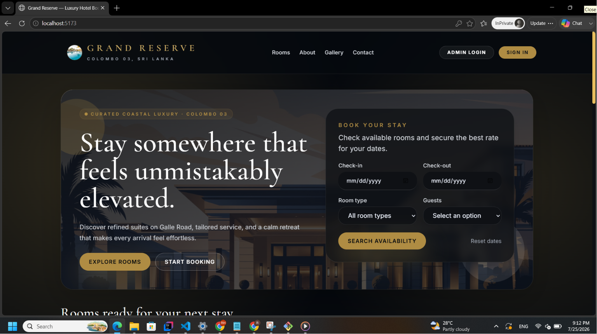

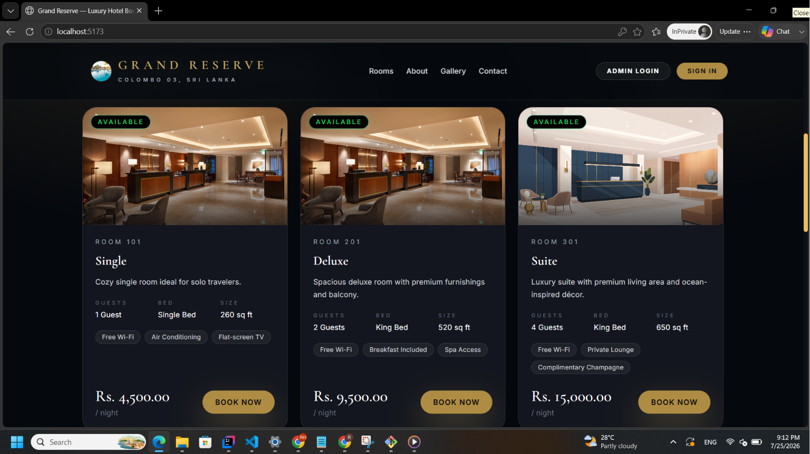

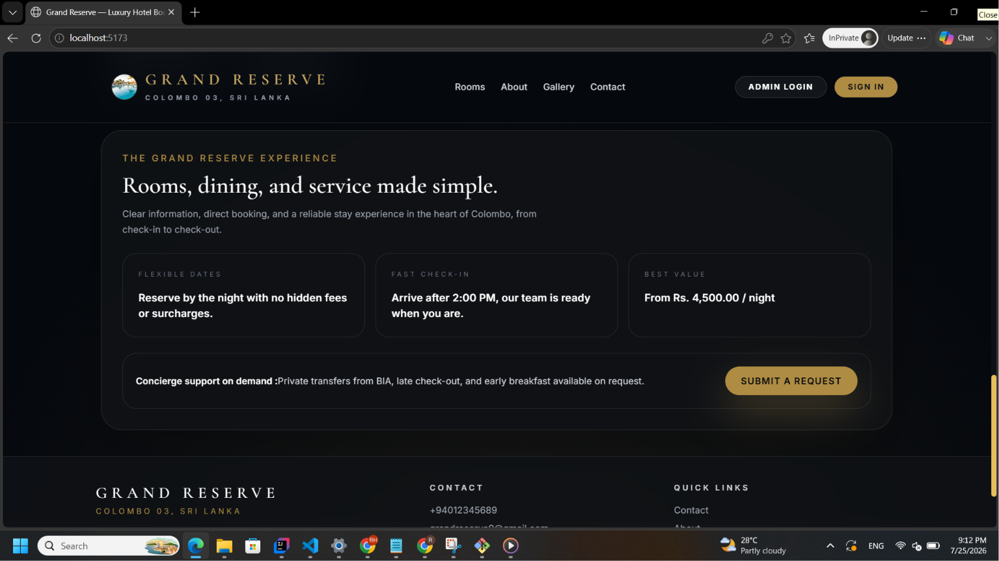

## About

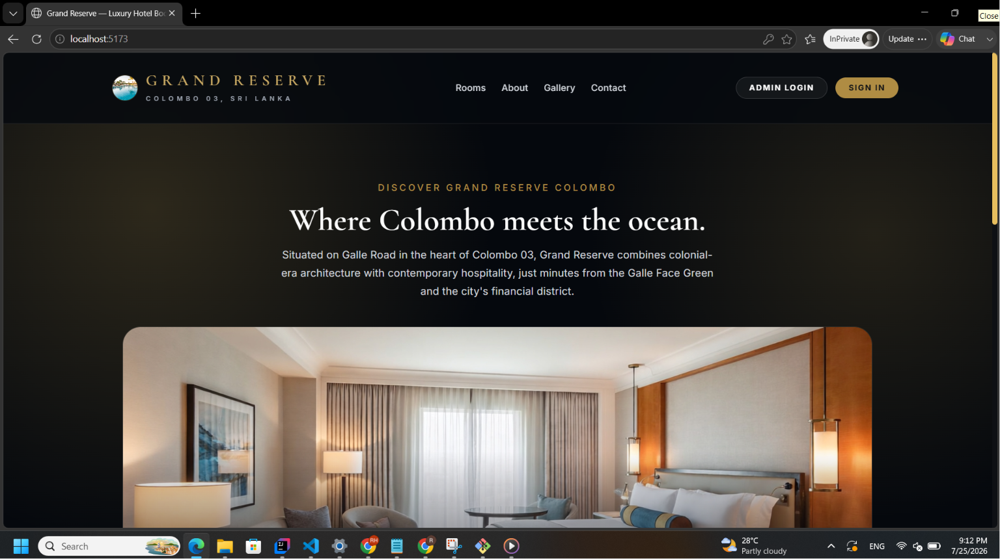

## Gallery

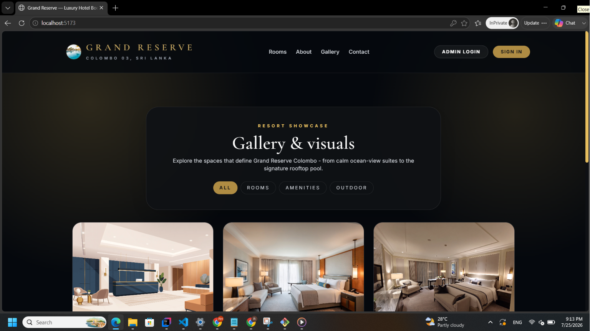

## Contact

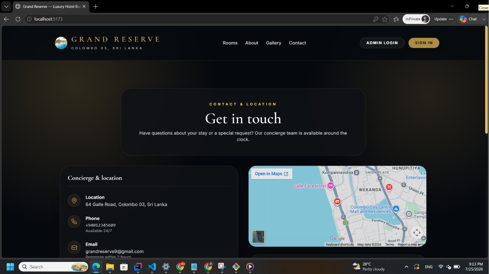

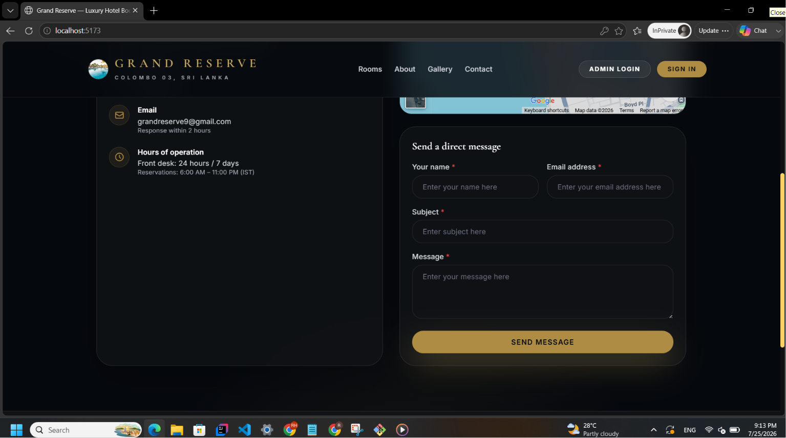

## Sign In / Register

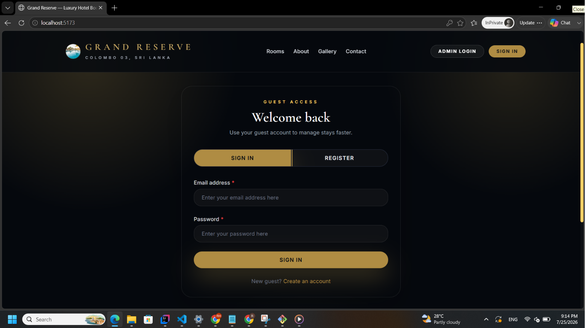

## Admin Dashboard

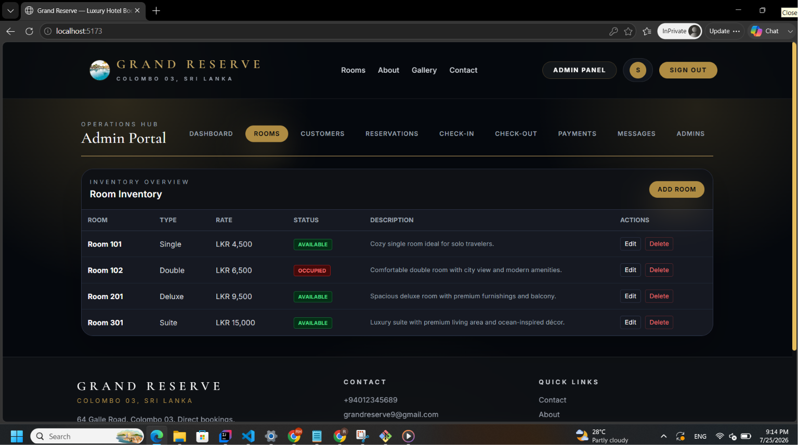

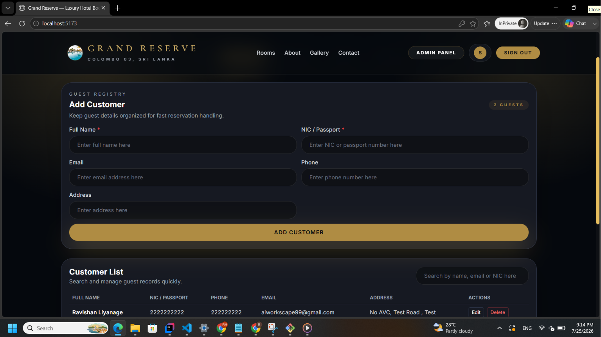

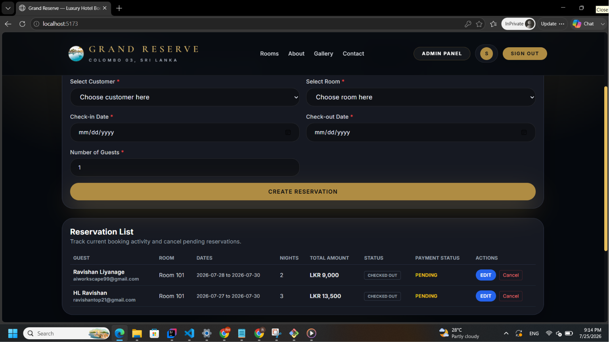

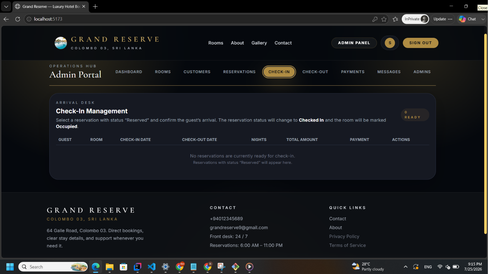

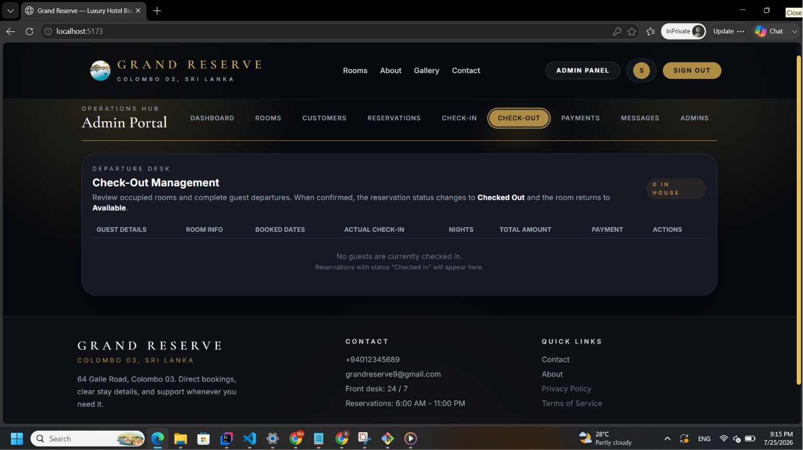

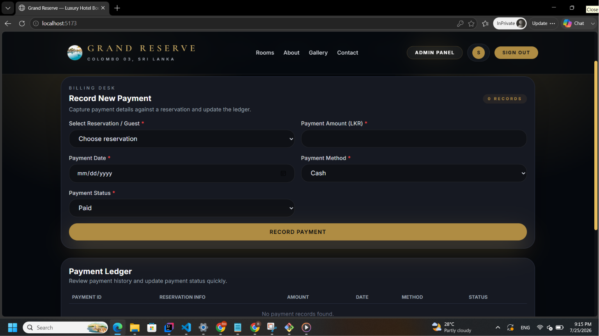

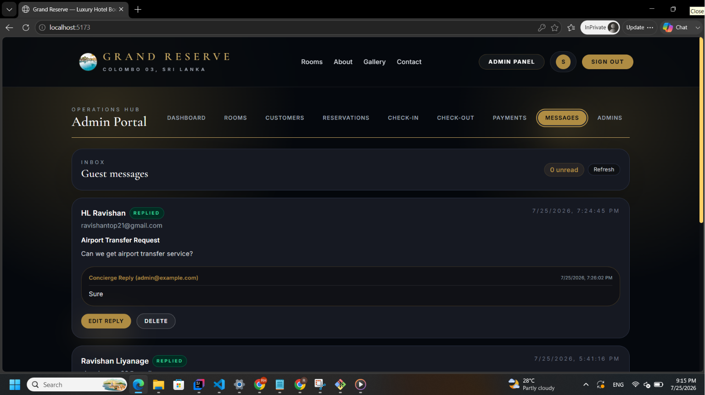

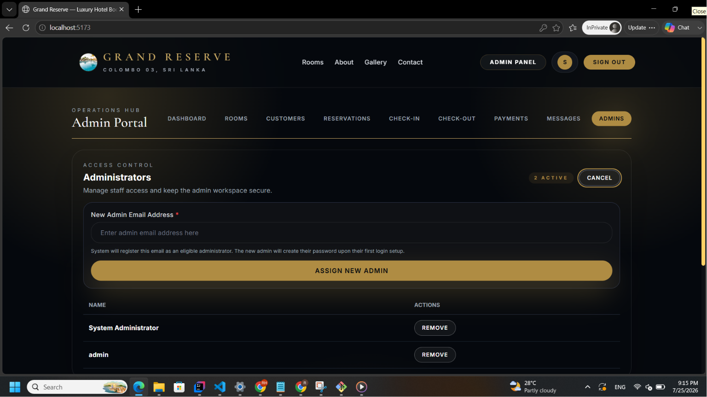

---

# License

This project is available for educational and portfolio purposes.

You may modify and extend the application for your own use.

---

# Authors

**Ravishan & Tharusha**

If you found this project helpful, consider giving it a ⭐ on GitHub.
